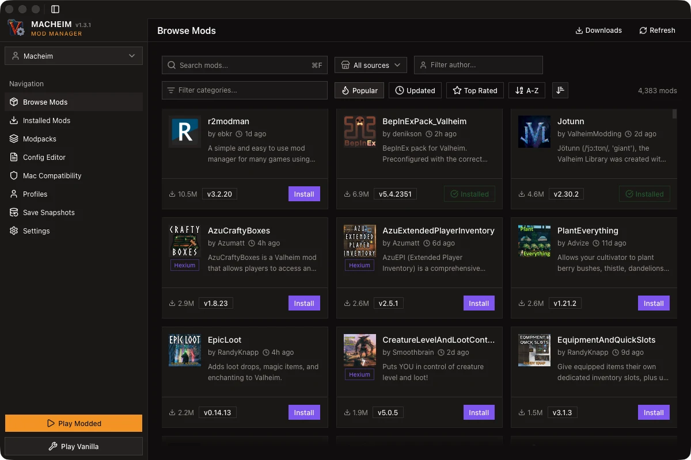
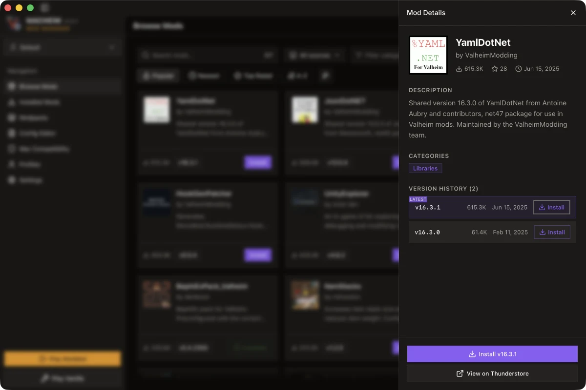
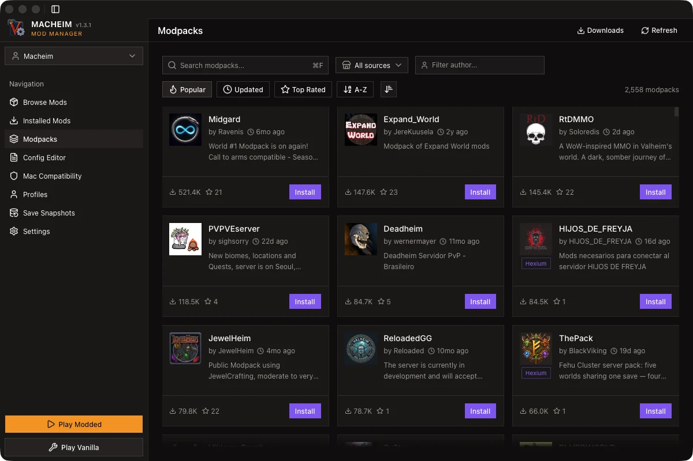
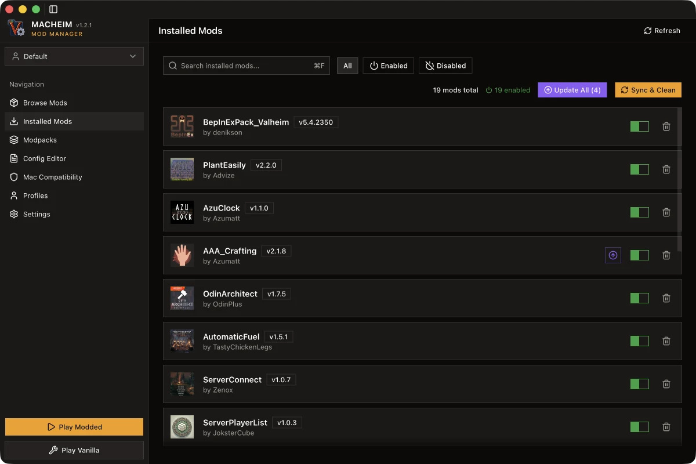
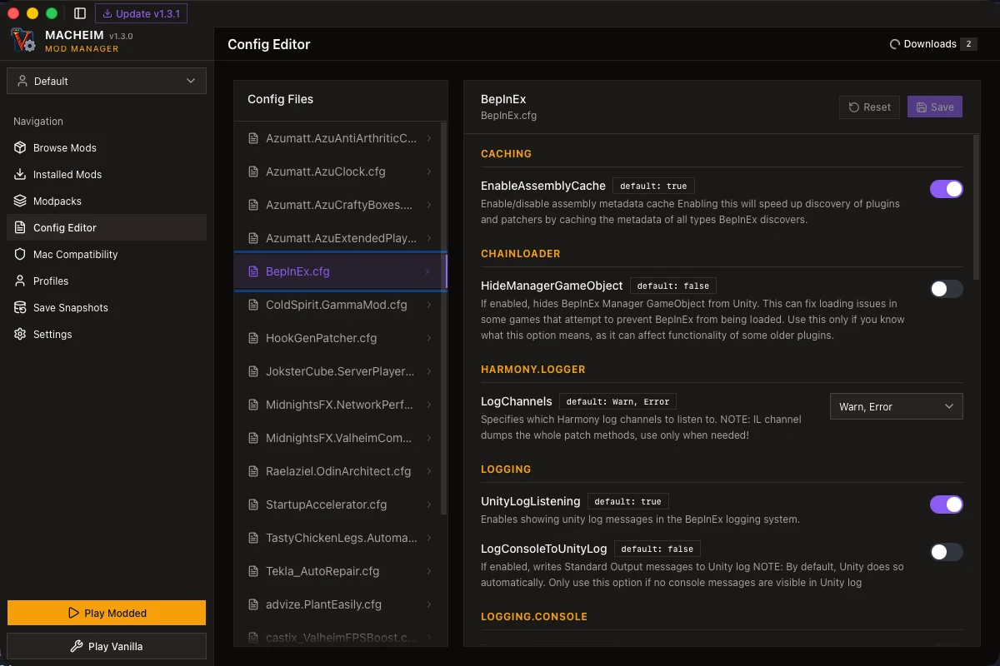
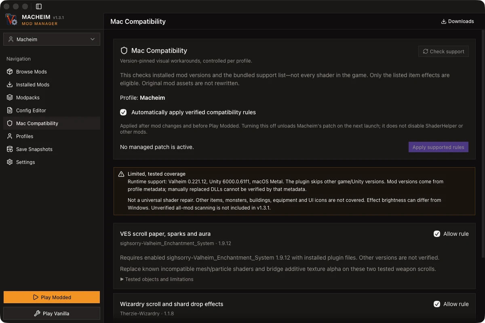

# Macheim — Valheim Mod Manager for macOS

### Thunderstore and Hexium mods on Apple Silicon and Intel Macs, without the Terminal

[](LICENSE)

[](https://github.com/LovelessCodes/Macheim/releases/latest)
[](https://github.com/LovelessCodes/Macheim/releases)
[](https://tauri.app)

> **The current Thunderstore mod managers — [Gale](https://github.com/Kesomannen/gale), [r2modman](https://github.com/ebkr/r2modmanPlus) and Thunderstore Mod Manager — have no official macOS build.**
> Macheim does.

Macheim is a native macOS mod manager for [Valheim](https://store.steampowered.com/app/892970/Valheim/), built with Tauri v2. It finds your Steam install, sets up BepInEx, browses [Thunderstore](https://thunderstore.io/c/valheim/) and [Hexium](https://hexium.gg/), resolves dependencies, and launches the game modded — with profiles, backups, crash triage and world snapshots included.

Requirements: **macOS 12+**, **Apple Silicon or Intel**, and Valheim installed via Steam. Free and open source (MIT).

This repository is an independently maintained build of [lofcgi/macheim](https://github.com/lofcgi/macheim) by [@lofcgi](https://github.com/lofcgi). Upstream provides Valheim detection, BepInEx management, Thunderstore browsing, profiles, backups and the Mac Compatibility system; this build layers a large set of quality-of-life, diagnostics and mod-management improvements on top. See [what this build adds](#what-this-build-adds).

## Screenshots

|                 Browse Mods                  |                 Mod Details                  |                Modpacks                |
| :------------------------------------------: | :------------------------------------------: | :------------------------------------: |
|  |  |  |

|                   Installed Mods                   |                  Config Editor                   |                    Mac Compatibility                     |
| :------------------------------------------------: | :----------------------------------------------: | :------------------------------------------------------: |
|  |  |  |

All screenshots are 1200×800 captures of the running app; see [screenshots/README.md](screenshots/README.md) to refresh them.

## Install

1. Download the DMG for your Mac from the [Releases](https://github.com/LovelessCodes/Macheim/releases) page:
   - **Apple Silicon** (M1/M2/M3/M4) — `Macheim_<version>_aarch64.dmg`
   - **Intel** — `Macheim_<version>_x64.dmg`
2. Open the DMG and drag **Macheim** to your Applications folder.
3. **Important:** the app is ad-hoc signed but not Apple-notarized, so macOS will block the first launch. Try **System Settings → Privacy & Security → Open Anyway** first. If macOS instead reports that the app is damaged, open Terminal and run:
   ```bash
   xattr -cr /Applications/Macheim.app
   ```
4. Open Macheim normally. Only remove the quarantine attribute after confirming you downloaded Macheim from this repository's Releases page.

Macheim is also a normal macOS app the rest of the time: no background daemon, no kernel extension, nothing installed system-wide. It writes inside your Valheim folder and `~/Library/Application Support/com.macheim`.

## Macheim vs Gale and r2modman on macOS

All three are free Thunderstore mod managers. The difference is the platform.

|                                                     |                Macheim                |         Gale         |         r2modman         | Thunderstore Mod Manager | Manual BepInEx |
| --------------------------------------------------- | :-----------------------------------: | :------------------: | :----------------------: | :----------------------: | :------------: |
| macOS build (Apple Silicon + Intel)                 |                  Yes                  |          No          |    No official build     |    No (Windows only)     | Works, by hand |
| Games supported                                     |             Valheim only              | 150+ on Thunderstore |           150+           |         Multiple         |    Valheim     |
| Mod sources                                         |         Thunderstore, Hexium          | Thunderstore, Hexium |       Thunderstore       |       Thunderstore       |  Thunderstore  |
| One-click installs, dependency resolution, profiles |                  Yes                  |         Yes          |           Yes            |           Yes            |       No       |
| Import r2modman / Thunderstore profiles             |           Yes (file + code)           |         Yes          |           Yes            |           Yes            |       —        |
| Publish modpacks to Thunderstore                    |                  No                   |         Yes          |           Yes            |           Yes            |       —        |
| Mod config editor                                   |                  Yes                  |         Yes          |           Yes            |           Yes            |  Text editor   |
| Gatekeeper, BepInEx and Rosetta launch handling     |                  Yes                  |         n/a          |           n/a            |           n/a            |     Manual     |
| Crash triage, Safe Mode, save snapshots             |                  Yes                  |          —           |            —             |            —             |       —        |
| Footprint                                           | 5.7 MB DMG / 16 MB app (native Tauri) |   ~8 MB installer    | Electron, hundreds of MB |         Electron         |       —        |
| License                                             |               MIT, free               |    GPL-3.0, free     |        MIT, free         |    Proprietary, free     |      n/a       |

**Gale** is the current pick on Windows and Linux: actively developed, 150+ games, profile import from other managers, and modpack publishing built in. **r2modman** still works and is widely installed, but is no longer the only good choice on Windows. Neither ships a macOS build — and neither does Thunderstore Mod Manager, which is Windows-only via Overwolf. That is the gap Macheim fills.

Macheim trades Gale's breadth for macOS depth. It is Valheim-only, but it owns the parts of the workflow that only exist on a Mac: removing Gatekeeper quarantine from BepInEx libraries, installing and patching the mod loader, forcing the `arch -x86_64` launch path that BepInEx needs on Apple Silicon, and applying the version-pinned [Mac Compatibility](#mac-compatibility) workarounds. It adds crash triage, Safe Mode and world/character snapshots that no other manager here offers.

## What this build adds

Upstream handles the core workflow. This build adds:

### Browsing

- **Multiple mod sources** — browse Thunderstore and [Hexium](https://hexium.gg/) in one list, or filter to a single source (Thunderstore / Hexium / All sources)
- **Multi-select category filters** — combine several categories instead of one, with selected chips collapsing into a "first +N" summary
- **Modpacks split out** — modpacks are excluded from Browse Mods and live in their own tab
- **Persistent package cache** — Thunderstore package data is cached locally, so repeat visits load instantly
- **Resilient icons** — failed CDN icons fall back automatically instead of rendering broken
- **Polished browsing** — virtualized lists, scroll fade, scroll-to-top button, staggered loading skeletons, and a richer empty/loading state

### Mod management

- **Profile sharing and migration** — export any profile as an `.r2z` file that Macheim, r2modman, Gale and Thunderstore Mod Manager can all import, or share it as a short-lived profile code; import a shared profile from an `.r2z` file, a Thunderstore profile code, or by dropping the file onto the window. Imported profiles keep every mod pinned to the version they were exported with; after importing you can activate the profile and queue all its downloads in one step
- **Profile clone and export** — clone a profile (with its configs) as a starting point, or export one to share
- **Modpack subscriptions** — follow a published Thunderstore modpack from the Modpacks tab and link it to a new or existing profile. The profile is badged with the pack name and flags when the store has a newer version, and the link can be removed at any time without touching the profile's mods
- **Bulk mod actions** — select several installed mods, or Select all within the current search and filter, and enable, disable or uninstall them in one batch (one confirmation for a bulk uninstall)
- **Undoable profile deletion** — removing a profile offers Undo on the toast, and a Deleted profiles section on the Profiles page can restore an archived profile or delete it permanently later, one at a time or all at once
- **Conflict detection** — the Installed Mods page flags duplicate plugin files and dependency version clashes, refreshed after installs, syncs and toggles
- **Developer console toggle** — decide whether "Play Modded" adds Valheim's `-console` flag, from Settings
- **Install from file** — drag and drop mod `.zip` archives or a shared profile `.r2z` onto the window, or pick them with "Install from file" on the Installed Mods page; archives are matched back to their Thunderstore listing (so author, icon and update checks are correct) and queue like any other install
- **Background download queue** — installs queue instead of failing when Valheim is running or the connection drops, then start automatically once the game closes or the network returns. Track, pause, resume, cancel, retry, uninstall and re-install downloads from the header button, anywhere in the app; the queue survives app restarts
- **Update detection and "Update All"** — installed mods are checked against latest versions, with a one-click bulk update for everything that's outdated
- **Version pinning** — hold a mod at its installed version: Update All and the per-mod update skip it, the row is badged as pinned, and conflict detection explains when a pin no longer satisfies another mod's requirement. Manual mods have no pin control because they never auto-update
- **Version history and downgrades** — open a mod's Version History to install or switch to an older release directly from the detail panel
- **Unused dependency cleanup** — installs record whether a mod was asked for or pulled in as a dependency, and "Remove unused" on Installed Mods lists dependency-installed mods nothing depends on any more — transitive closure included — and removes them after one confirmation. Pinned, manually installed and explicitly installed mods are never swept
- **Safer uninstalls** — uninstalling from the installed list asks for confirmation first (hold Shift to skip), and names the installed mods that depend on what you are removing — disabled dependents included, since removal breaks them on re-enable
- **Clearer installed list** — outdated versions are badged, row actions use tooltips, and the scroll-to-top button sits bottom-center, clear of the row controls

### Diagnostics and recovery

- **BepInEx log viewer** — read the latest Valheim log in the app: filter by level, search with match highlighting, copy lines, and open the log folder in Finder. Follow mode tails new lines while the game runs, auto-scrolls, and pauses when you scroll up — so a mod that silently fails to load is visible without leaving Macheim
- **Crash triage** — modded launches are watched; an early exit produces a crash report with the failure category, likely culprit mods, the exception stack and the log tail
- **Safe Mode** — disable every mod and launch from the report or Settings, then restore them from the banner; "Analyze latest log" runs the same analysis any time
- **World and character snapshots** — snapshot worlds and characters on demand, or automatically before every modded launch (last five kept); restoring replaces the live saves and keeps a safety snapshot of the previous state first

### Launching

- **Quiet Steam handling** — a running Steam client is never focused or restarted, and a missing one is started hidden in the background (with the game waiting for it), so the client window stays out of the way; Settings shows whether Steam is running

### Under the hood

- **TanStack Query data layer** — fetching, caching, and mutations run through TanStack Query with a persisted cache, which is the foundation for the offline-friendly cache and consistent loading states above
- **Bun toolchain** — package management, scripts, and CI run on [Bun](https://bun.sh/)
- **Linting and formatting** — oxlint (type-aware) and oxfmt, wired up through Husky and lint-staged on commit

Upstream behaviour this build does **not** change: BepInEx/Rosetta launch handling, Mac Compatibility rules, profile/recovery semantics, and the backup format.

## Features

Inherited from upstream and still present here:

- **Auto-detect Valheim** — finds your installation via Steam's `libraryfolders.vdf`
- **One-click BepInEx install** — downloads and configures BepInEx from Thunderstore, handles macOS Gatekeeper automatically
- **Thunderstore mod browser** — search and filter thousands of mods (Popular / Newest / Top Rated / A-Z)
- **One-click mod install** — automatic dependency resolution by topological sort
- **Modpack support** — install entire modpacks with all dependencies in one click
- **Profile management** — create, clone, export and import profiles; the active profile is remembered across restarts and manual mods are preserved
- **Mac Compatibility** — automatically apply version-pinned visual workarounds for tested item effects, with per-profile and per-rule opt-out
- **BepInEx config editor** — edit mod configuration files directly in the app
- **Backup and restore** — back up profile metadata and configs (not mod binaries or worlds); restore into a separate profile
- **Sync and Clean** — re-download missing enabled mod files; confirm before moving unmanaged folders to recoverable storage
- **Play Modded** — launch Valheim with mods, using Macheim's Rosetta launch path on Apple Silicon automatically
- **In-app updates** — quiet background update checks; a new version is downloaded and installed only when you choose, then applied on restart
- **Dark viking-themed UI** — built for the Valheim aesthetic
- **Lightweight** — 5.7 MB DMG, 16 MB app (Electron-based alternatives are ~1.3 GB)

## Getting started

1. **Launch Macheim** — the Setup Wizard detects your Valheim installation
2. **Install BepInEx** — click "Install BepInEx" to set up the mod framework
3. **Browse Mods** — go to the Mods tab and browse or search Thunderstore and Hexium
4. **Install** — click any mod to see details, then click "Install" to download it with all dependencies
5. **Play Modded** — click "Play Modded" to launch Valheim with your mods enabled

## FAQ

### Do Gale or r2modman work on macOS?

No. [Gale](https://github.com/Kesomannen/gale) — currently the most actively developed Thunderstore manager — ships Windows and Linux builds only (MSI, Scoop, WinGet, AUR, .deb, .rpm, Flatpak, AppImage), and macOS is not supported. r2modman has no official macOS build either, and Thunderstore Mod Manager is Windows-only via Overwolf. Macheim is a native macOS alternative that talks to the same Thunderstore and Hexium APIs, so the mods themselves are identical.

### How do I install Valheim mods on macOS?

Use a mod manager. Manually you would install BepInExPack into `valheim.app`, resolve every mod's dependencies by hand, and move `.dll` files into `BepInEx/plugins`. Macheim does all of that in one click, per profile, and also handles the Rosetta launch path that modded Valheim needs on Apple Silicon. See [Getting started](#getting-started).

### Can I run Macheim on Apple Silicon?

Yes. Macheim publishes native builds for Apple Silicon (M1/M2/M3/M4) and Intel — download the `aarch64` DMG on an M-series Mac. Modded Valheim itself still runs under Rosetta, see below.

### Does modded Valheim run natively on Apple Silicon?

No. BepInEx is an x86_64 framework, so the supported modded launch path uses `arch -x86_64` and requires Rosetta. The Macheim app is native; the modded game is not. Experimental native-ARM BepInEx builds are not integrated or supported here.

### Why does macOS say Macheim is damaged or can't be opened?

Macheim is ad-hoc signed but not Apple-notarized, so Gatekeeper blocks the first launch. Use **System Settings → Privacy & Security → Open Anyway**, or run `xattr -cr /Applications/Macheim.app` if macOS reports the app as damaged. Full steps are in [Install](#install) and [Troubleshooting](#macos-says-macheim-is-damaged-or-cannot-be-opened).

### What is the best mod manager for Valheim on macOS?

Macheim is the only native option, so on macOS the short answer is Macheim. On Windows or Linux, Gale is the current pick and r2modman remains a fine alternative — both support more games than Macheim does and can import each other's profiles. If you play Valheim on both a Mac and a PC, export a profile from the PC manager and import the `.r2z` file in Macheim (or the other way around) to keep the two setups in sync.

### Can I import an r2modman or Thunderstore profile code?

Yes. On the Profiles page, choose **Import** and paste a Thunderstore profile code, or pick an `.r2z` file exported by r2modman, Gale or Thunderstore Mod Manager — you can also drag the `.r2z` file straight onto the window. Codes expire after about an hour, so ask for a fresh one or use a file export; Macheim creates codes too (the export menu on any profile has **Share as code**). Macheim also imports its own `.r2z` and JSON exports. Every mod keeps the version it was exported with, and after importing you can activate the profile and queue its downloads in one step. Manual mods have no store listing, so they are not part of an export.

### Where does Macheim keep its files?

| What                  | Location                                                     |
| --------------------- | ------------------------------------------------------------ |
| Saved profiles        | `~/Library/Application Support/com.macheim/profiles`         |
| Removed profiles      | `~/Library/Application Support/com.macheim/deleted-profiles` |
| Cleaned mod folders   | `<Valheim>/BepInEx/.macheim-clean-backups`                   |
| Compatibility backups | `<Valheim>/BepInEx/.macheim-compat-backups`                  |

These are local recovery copies. Keep your own backup of worlds and manual mods.

### Is Macheim free?

Yes. MIT licensed, no account, no telemetry. Logs stay local and are never uploaded.

## Troubleshooting

### macOS says Macheim is damaged or cannot be opened

The app is ad-hoc signed, not notarized. First try **System Settings → Privacy & Security → Open Anyway**. If macOS blocks it anyway, remove the quarantine attribute:

```bash
xattr -cr /Applications/Macheim.app
```

After BepInEx installation, macOS may also block individual libraries. Macheim removes quarantine attributes from the dylibs it manages; if something is still blocked, allow it under **System Settings → Privacy & Security**.

### Pink or magenta objects

Some mod-added objects (buildings, creatures, effects) may render pink/magenta or with incorrect transparency. Causes include missing Metal shader variants and incompatible material/shader settings, and a shader reported as supported can still render incorrectly. **The Mac Compatibility workarounds cover only the objects listed under [Mac Compatibility](#mac-compatibility).** Report the mod version, the affected object and a screenshot in [Discussions](https://github.com/LovelessCodes/Macheim/discussions), and don't assume every pink object has the same cause.

### BepInEx requires Rosetta

Macheim's supported modded launch path uses `arch -x86_64` and requires Rosetta on Apple Silicon. If Rosetta is missing:

```bash
/usr/sbin/softwareupdate --install-rosetta --agree-to-license
```

The manager app itself is native Apple Silicon; that does not mean the modded game runs natively on ARM.

### Mods don't load, or the game exits early

Open **Settings → Analyze latest log**, or read the **Logs** page, or launch once and read the crash report Macheim generates. **Safe Mode** disables every mod so you can confirm the game runs clean, then restore mods from the banner. Common causes are a missing dependency and a mod that hasn't been rebuilt for your Valheim version.

### Multiplayer and other mod managers

Macheim does not translate mods or synchronize a server's mod requirements. Use the same compatible mod versions on every client and server. The Mac Compatibility patch changes visuals only — it does not change item stats or network behaviour — but cross-platform multiplayer has not been end-to-end validated. Future Valheim releases are not guaranteed to be compatible on day one.

### Valheim version compatibility

Mod compatibility moves fast around game updates. Macheim's Mac Compatibility workarounds are pinned to versions that have been tested — currently Valheim **0.221.12**, Unity **6000.0.61f1** — and newer game builds are skipped rather than guessed at. If a mod misbehaves after a Valheim update, check its Thunderstore page for a rebuilt release, then use **Version History** in Macheim to pin a working version or downgrade.

## Requirements

- **macOS 12+** (Monterey or later)
- **Apple Silicon** (M1/M2/M3/M4) or **Intel** Mac
- **Valheim** installed via Steam
- **Rosetta 2** on Apple Silicon, for the modded game and BepInEx (see [Troubleshooting](#troubleshooting))
- Internet connection for downloading mods

## Mac Compatibility

Open **Mac Compatibility → Check support** to inspect the bundled catalog and the active profile. This is a mod/version check, not a visual scan of every shader. Eligible rules are reconciled after mod changes and before **Play Modded**. Quit Valheim before applying or disabling them.

The catalog covers four tested dropped items: VES F weapon and blessed F weapon scrolls (Valheim Enchantment System 1.9.12), and the Wizardry 1.1.8 Black Forest scroll and Bonemass shard. ShaderHelperForMac **3.3.0** must already be enabled; Macheim does not silently install or reset it. Runtime checks restrict the patch to Valheim **0.221.12**, Unity **6000.0.61f1**, and macOS Metal.

- Disable **Automatically apply verified compatibility rules** to unload Macheim's patch on the next launch, or disable an individual rule. Other shader mods remain active.
- Updates outside the verified mod versions are skipped; a previously managed patch is removed when no rules remain eligible.
- The plugin clones runtime materials/textures; upstream mod assets are unchanged.
- No universal repair, all-mod scanner, creature/building/UI fixes, or Windows visual parity is promised.
- Logs are shown locally, never uploaded. A missing log entry is not a compatibility pass.

## Profile and recovery notes

When upgrading an older installation with multiple profiles and no active-profile record, the live mod files are preserved in a new `Recovered-…` profile. Existing profiles are not overwritten. Switch to your preferred profile after reviewing it. Symlinked mod/profile paths are refused during replacement; back them up and resolve the links first. Do not change profiles while Valheim is running.

An imported profile starts with its config files but no mod files: activate it and Macheim queues the downloads, or switch to it and use **Sync & Clean** later. Exporting includes the profile's config files, which can contain server addresses or passwords — review them before sharing. Manual mods are not part of an export.

Deleting a profile moves it to the Deleted profiles section rather than erasing it: Undo on the toast or Restore in that section puts it back (a restore consumes the archive), and Delete permanently removes it after a confirmation.

## Build from source

Prerequisites: [Bun](https://bun.sh/), current stable [Rust/Cargo](https://rustup.rs/), and Xcode Command Line Tools. The Tauri CLI is a project dependency. If the build says `cargo metadata` cannot be found, install Rust with rustup and restart your terminal.

```bash
git clone https://github.com/LovelessCodes/Macheim.git
cd Macheim
bun install
bun run test
bun run verify:release
bun run tauri build
```

The built DMG will be in `src-tauri/target/release/bundle/dmg/`.

The application embeds only Macheim's own compatibility DLL, alongside its source and a SHA-256/source manifest. Building the manager does not require Valheim or .NET. To rebuild the plugin itself, install .NET 9 and Valheim/BepInEx locally, then run `sh scripts/build-compatibility.sh`. No game or third-party reference DLLs are redistributed. See [compatibility details](tools/item-material-compat/README.md).

## Tech stack

| Layer     | Technology                              |
| --------- | --------------------------------------- |
| Framework | [Tauri v2](https://tauri.app/)          |
| Backend   | Rust (Tauri commands)                   |
| Frontend  | React 19 + TypeScript + Tailwind CSS v4 |
| Data      | TanStack Query (persisted cache)        |
| State     | Zustand                                 |
| UI Icons  | Lucide React                            |
| Tooling   | Bun, oxlint, oxfmt, Husky, lint-staged  |

## How it works

Macheim uses Tauri v2 to bridge a Rust backend with a React frontend:

- **Game detection** — parses Steam's `libraryfolders.vdf` to locate Valheim
- **BepInEx management** — downloads from Thunderstore, patches the config for macOS (`Type = GameObject`), and removes the Gatekeeper quarantine from dylibs
- **Mod installation** — downloads mod ZIPs, extracts to the correct profile directory, and resolves dependencies via Kahn's algorithm (topological sort)
- **Game launch** — uses `arch -x86_64 env DYLD_INSERT_LIBRARIES=libdoorstop.dylib` to load BepInEx into the game under Rosetta on Apple Silicon; SIP is not disabled

## Maintainer notes

### Update signing

Updates are signed with a minisign keypair so clients only install builds from this repository. The public key lives in `src-tauri/tauri.conf.json`; the private key must never be committed. Releases are advertised through the `latest.json` asset that `tauri-action` publishes, which the app fetches from `releases/latest/download/latest.json`.

Set up a fresh keypair once (skip if `~/.tauri/macheim.key` already exists):

```bash
bunx tauri signer generate -w ~/.tauri/macheim.key
```

Then store both values as GitHub Actions secrets:

- `TAURI_SIGNING_PRIVATE_KEY` — contents of `~/.tauri/macheim.key`
- `TAURI_SIGNING_PRIVATE_KEY_PASSWORD` — the password chosen above (empty if none)

Paste the matching `~/.tauri/macheim.key.pub` contents into `plugins.updater.pubkey` in `src-tauri/tauri.conf.json`. **Back up the private key**: losing it means existing installations can never be updated again. `bun run verify:release` fails if `createUpdaterArtifacts` is off, or if the pubkey or endpoints are missing.

Because releases start as drafts, the updater only sees a version after the release is published. Users on older builds will then be offered it on their next launch.

### Release notes

Every release is documented in [CHANGELOG.md](CHANGELOG.md). Add a `## [x.y.z]` section for the new version before tagging — `verify:release` fails on a tag without one, and the Release workflow turns that section into the GitHub release body via `bun run notes --tag vx.y.z` (compatibility and installation notes are appended automatically). Preview the rendered body locally before releasing:

```bash
bun run notes --tag v1.2.1
```

## Contributing

Contributions are welcome — open a Pull Request, or start a thread in [Discussions](https://github.com/LovelessCodes/Macheim/discussions).

1. Fork the repository
2. Create your feature branch (`git checkout -b feature/amazing-feature`)
3. Commit your changes (`git commit -m 'Add some amazing feature'`)
4. Push to the branch (`git push origin feature/amazing-feature`)
5. Open a Pull Request

If your change is a fix or improvement to upstream behaviour rather than a fork quality-of-life/visual feature, consider opening it against [lofcgi/macheim](https://github.com/lofcgi/macheim) as well, so everyone benefits.

## License

This project is licensed under the MIT License — see the [LICENSE](LICENSE) file for details.

## Acknowledgments

- [lofcgi](https://github.com/lofcgi) — author of the original [macheim](https://github.com/lofcgi/macheim) project this build is based on. Bug reports about upstream behaviour are best filed upstream.
- [Tauri](https://tauri.app/) — lightweight app framework
- [BepInEx](https://github.com/BepInEx/BepInEx) — Unity mod loader framework
- [Thunderstore](https://thunderstore.io/) — mod repository and API
- [Hexium](https://hexium.gg/) — additional mod source
- [Gale](https://github.com/Kesomannen/gale) — modern Thunderstore mod manager for Windows and Linux, and a good reference for what a manager here can do
- [r2modmanPlus](https://github.com/ebkr/r2modmanPlus) — the manager that started it, and inspiration for this project
- The Valheim modding community
